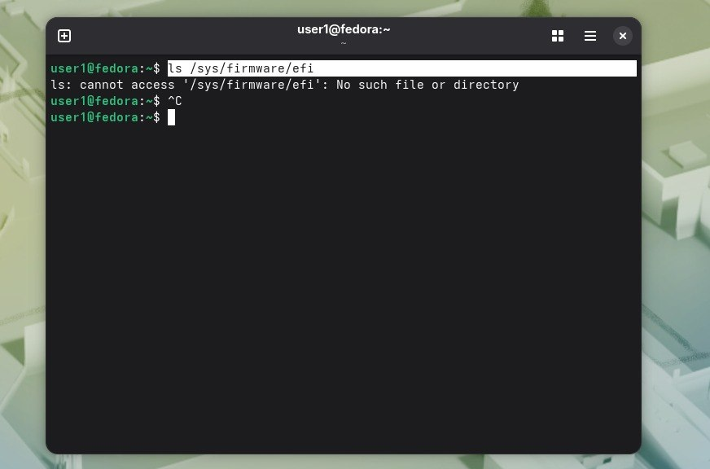
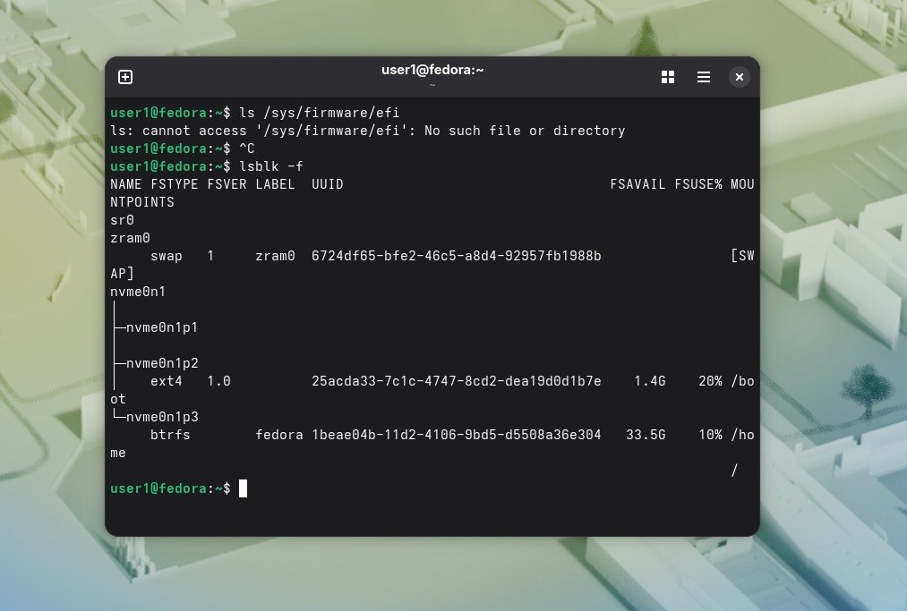
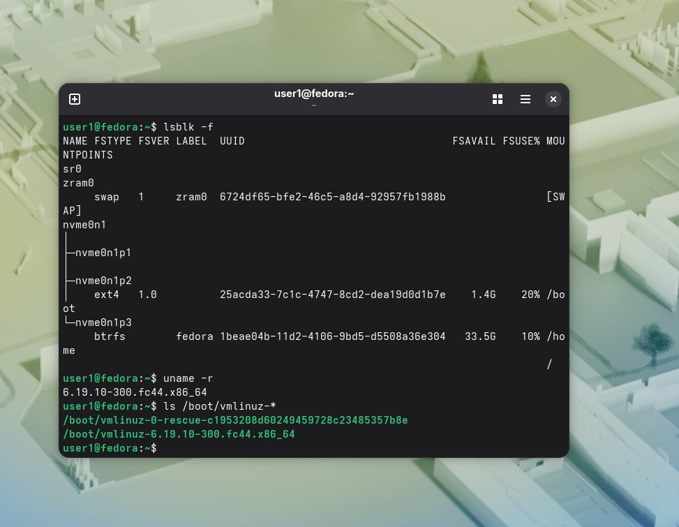

ls /sys/firmware/efi
Проверила наличие каталога,его нет,значит BIOS.  
. 
Посмотрела разделы командой lsblk -f.  
.  
Посмотрела,какое ядро сейчас работает командой uname -r.  
.  
Посмотрела,какие вообще есть ядра командой ls /boot/vmlinuz-*.  
. 
Версий ядра установлено 2, работает 6.19.10-300.fc44.x86_64.

