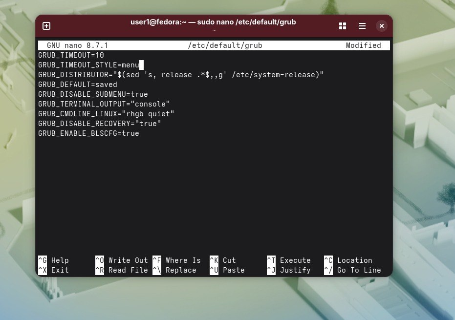
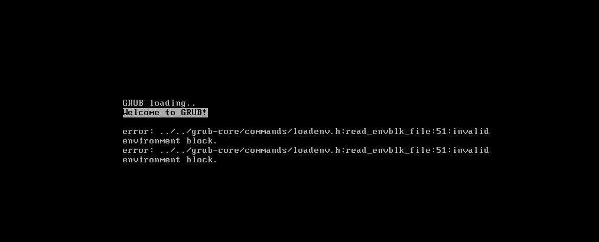
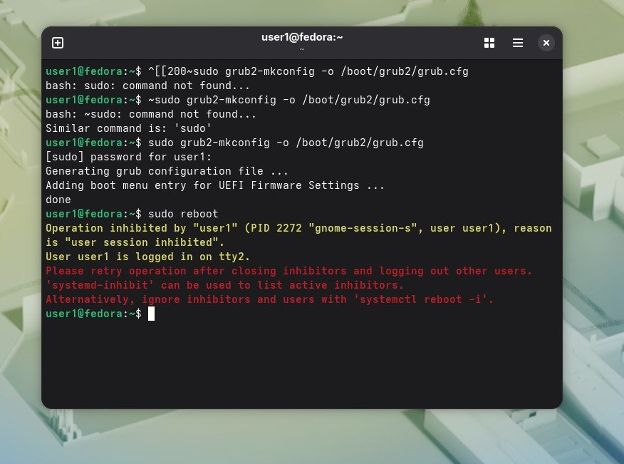

Параметр GRUB_TIMEOUT=10 означает количество секунд вывода меню.Потом поставила больше(30), чтоб успеть сделать скриншот.  

GRUB_TIMEOUT_STYLE=menu это стиль вывода меню(то,что оно показывается пользователю). 
Измененный файл:  

.  
Меню Grub:  
.

Если бы я забыла обновить,значение осталось бы тем же,и загрузка шла бы по старому.

Некоторые команды здесь не работали,так как в Федоре другие.Заменила на рабочие,например:  
.

