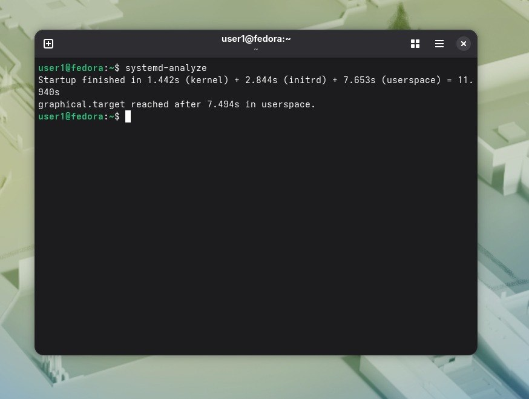
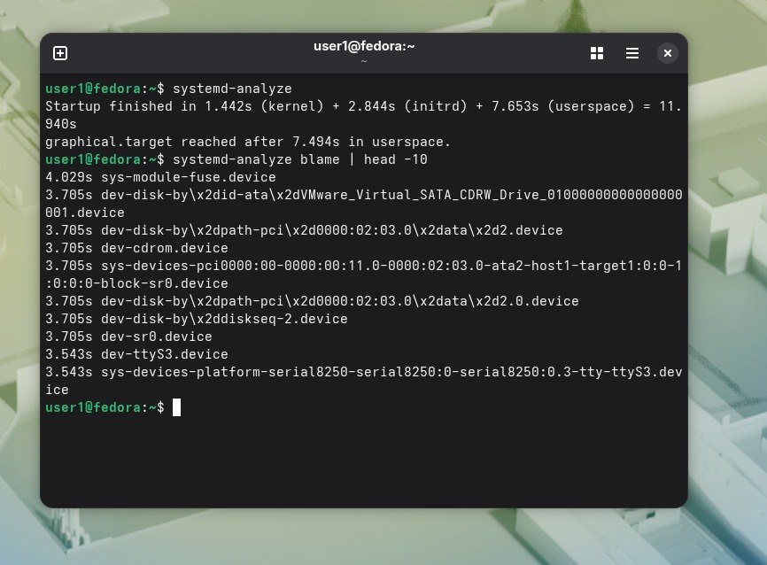
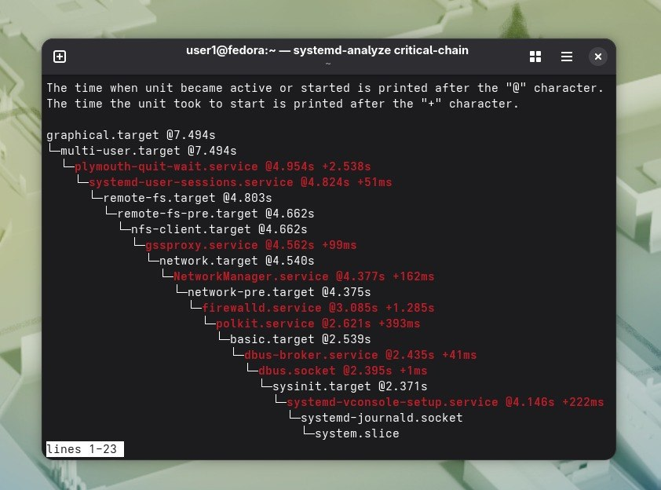

С помощью команды systemd-analyze посмотрела,сколько времени занимаетзагрузка по этапам.Получилось так:  

.  

То есть загрузка заняла почти 12 секунд, из этого ядро 1.442s, а пользовательское пространство 7.653s. 

С помощью systemd-analyze blame | head -10 посмотрела 3 самые медленных службы.Вот они:
3.705s dev-sr0.device
3.543s dev-ttyS3.device
3.543s sys-devices-platform-serial8250-serial8250:0-serial8250:0.3-tty-ttyS3.device
.  
С помощью systemd-analyze critical-chain посмотрела,что определяет время загрузки.  
.  
Эта служба опрашивает порты.
Опрашивается даже несуществующее оборудование,причем от него ожидается ответ 3.5 секунды.Поэтому она такая медленная.

