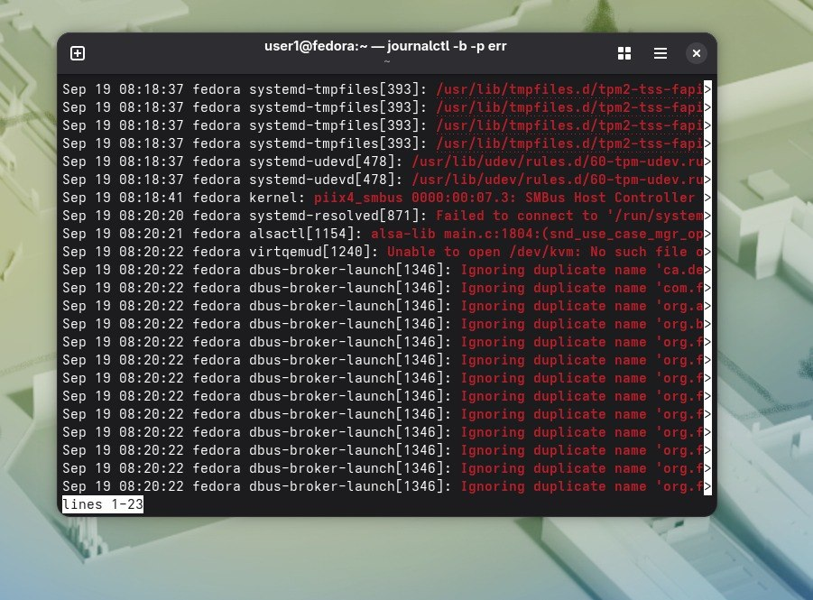
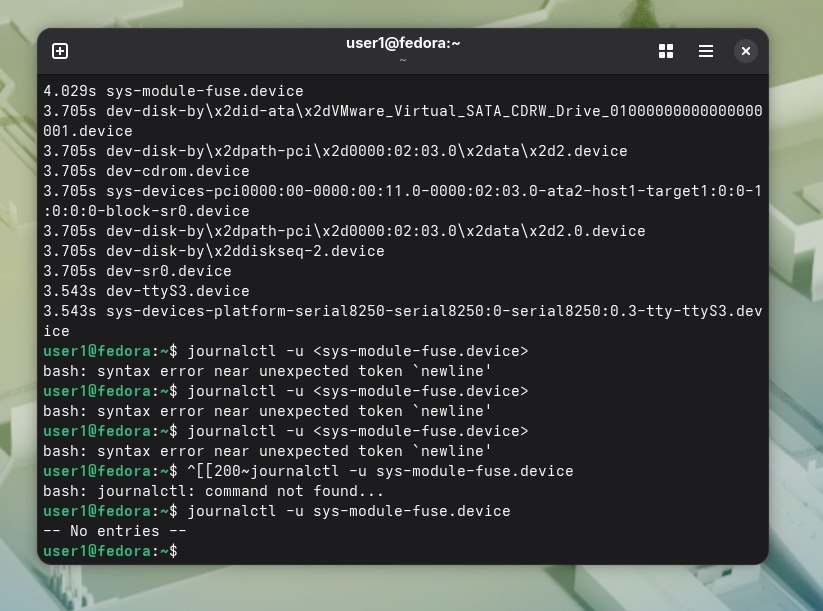
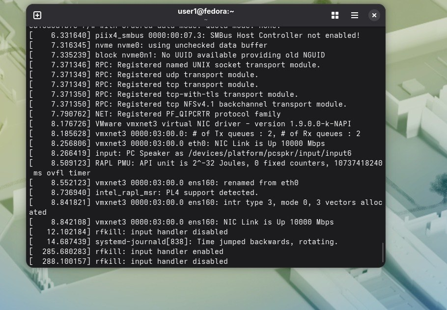

С помощью команды journalctl -b -p err нашла ошибки. Такие ошибки нашлись в текущей загрузке:  
.
Выбрала службу и прописала команду: journalctl -u sys-module-fuse.device.Смотрим не журнал.  
.
Последнее сообщение ядра находим с помощью dmesg | tail -30.
.  

Ответ на вопрос) Первый показывает логи текущей сессии, второй - предыдущей.Второй нужен, когда что-то уже произошло, а потом система перезагрузилась и надо понять,что не так.

