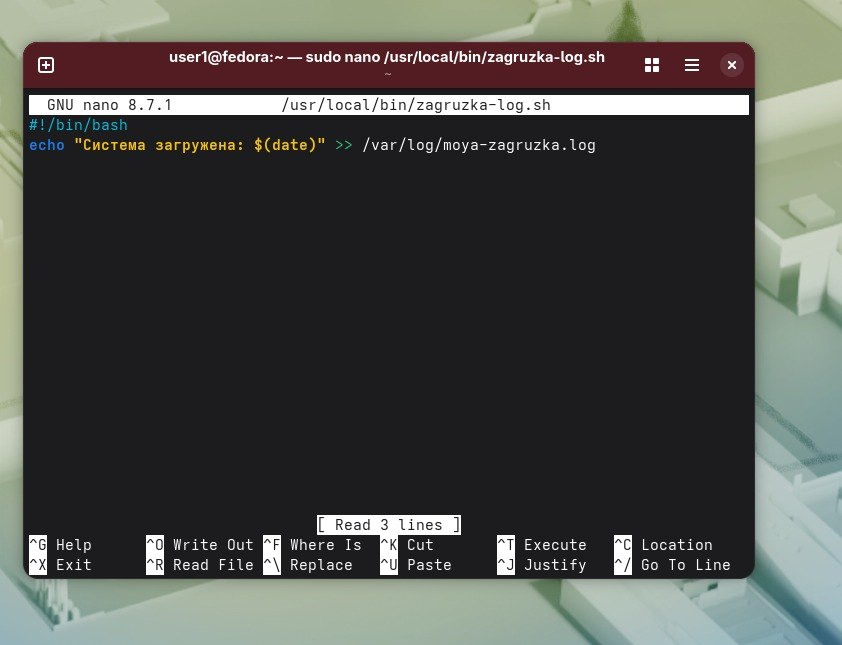
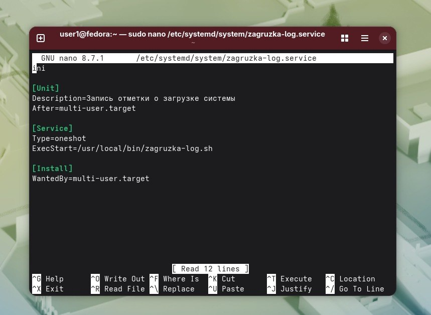
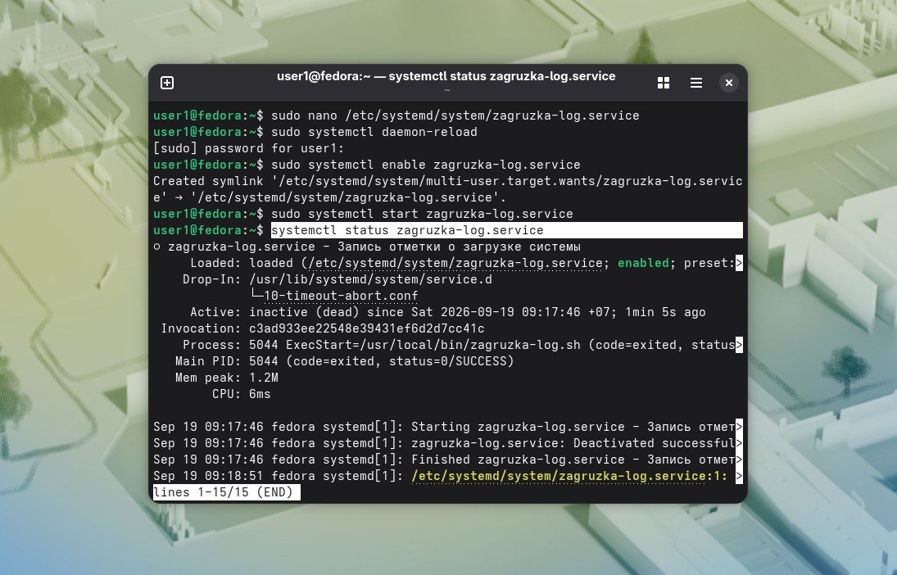
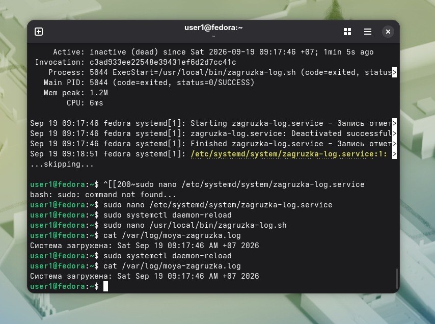

Что написано в файлах:  
.  
.  
Вывод systemctl status:  

Содержимое после 2 перезагрузок:  
. 
Type=oneshot значит,что процесс выполняется один раз.  
WantedBy=multi-user.target указывает, к какой цели привязана служба.Ьак система видит,что он нужен.
