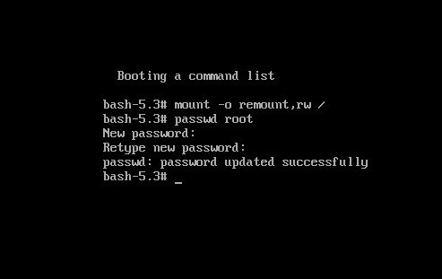
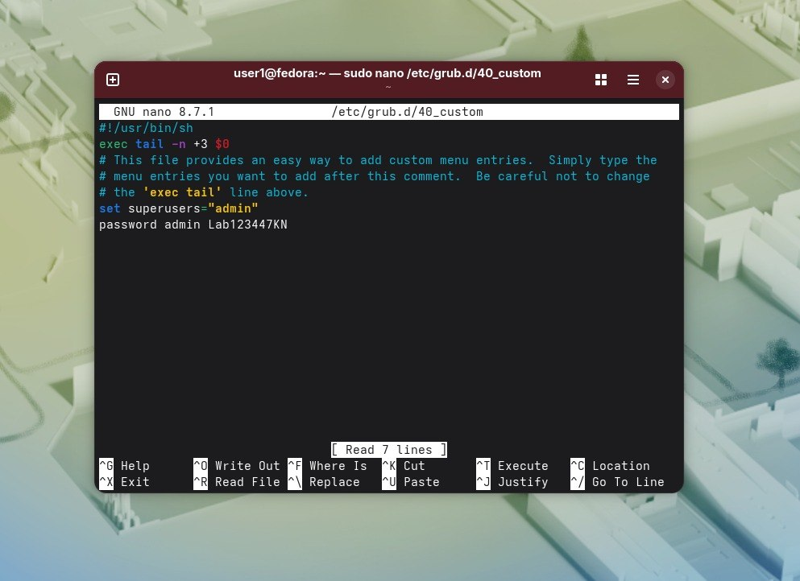
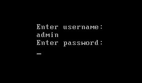

А такую оболочку попала.Пароль сменила.  
. 
Так можно, потому что в архитектуру linux изначально заложено, что тот, кто имеет физический доступ к компьютеру, имеет контроль над ос.Не хватает пароля на сам загрузчик.  
Создала файл для появления пароля на grub.  
.   
Теперь выглядит вот так:  
.   

Этот пароль защищает от несанкционированного изменения параметров ядра,от использования старых версий ядер, от доступа к своей же консоли.
Не защищает от физического сброса BIOS,загрузки чего либо с флешки,извлечения с диска.  
Потому что он не защищает от физического извлечения накопителей и сетевых атак и потому что сервера могут потом быть недоступны из за того, что администратор не пришел и не ввел пароль после экстренной перезагрузки.

